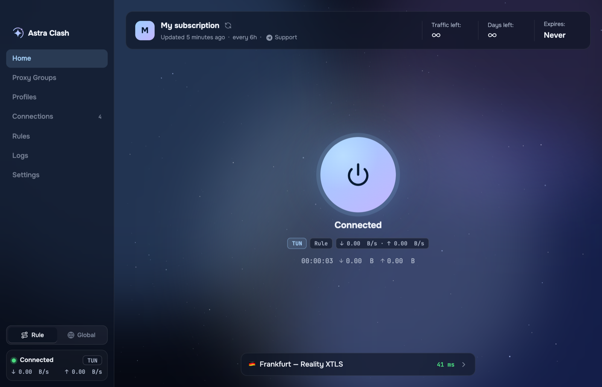
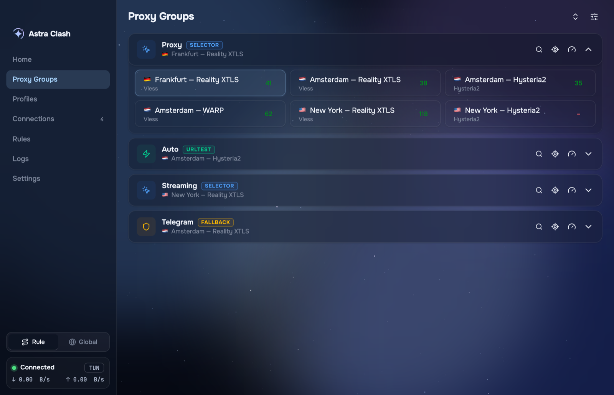
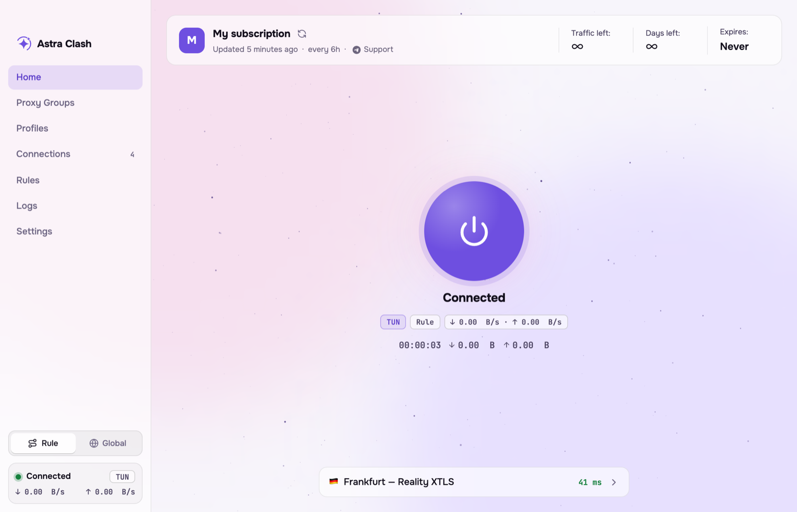
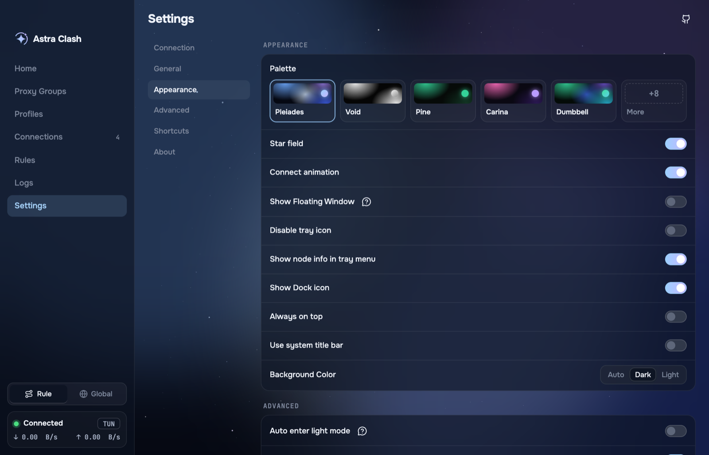

<p align="center">
  
</p>

<h1 align="center">Astra Clash</h1>

<p align="center">A desktop client for the <a href="https://github.com/MetaCubeX/mihomo">mihomo</a> proxy core, for macOS and Windows.</p>

Add a subscription link and press the power button. Traffic goes through the proxy either in TUN mode (a virtual network interface that covers every app) or as the system proxy.

## Screenshots

| | |
|---|---|
|  |  |
|  |  |

## Features

- One button to connect, in TUN mode or as the system proxy.
- Node picker on Home, plus pages for proxy groups, rules, connections and logs.
- Subscription details from your provider: traffic and days left, update interval, support link. Works with panels that serve mihomo configs, such as Remnawave.
- Menu bar menu (tray on Windows) with profiles, proxy groups, outbound mode and connection method.
- 13 color palettes in light and dark.
- English, Russian and Chinese.

## Download

From the [Releases](https://github.com/Derpcrawler/astra-clash/releases) page.

| Platform | File |
|---|---|
| macOS 13 or later, Apple Silicon | `Astra-Clash_<version>_arm64.pkg` |
| Windows 10 or 11, x64 | `Astra-Clash_<version>_x64-setup.exe` |

There are no Linux builds. Linux users can build from source (see below).

The builds are not signed with an Apple or Microsoft certificate, so each system warns once:

- **macOS:** the installer is blocked because it comes from an unidentified developer. Open System Settings, Privacy & Security, click Open Anyway next to the message about the installer, and run it again. The installer asks for an administrator password; it sets up the core so TUN mode works without asking again.
- **Windows:** SmartScreen shows "Windows protected your PC". Click More info, then Run anyway. The app asks for administrator rights when it starts, because TUN mode needs them.

The Windows build is new and has not been tested much yet.

To update, install the new version over the old one. Settings are kept.

## Build from source

Requirements: Node.js 20 or later, pnpm 10, and Go 1.21 or later for the Windows build.

```bash
git clone https://github.com/Derpcrawler/astra-clash.git
cd astra-clash
pnpm install   # also downloads mihomo, geo data and helper binaries for this machine
pnpm dev
```

Packages:

```bash
pnpm build:mac --arm64                  # dist/Astra-Clash_<version>_arm64.pkg

node scripts/prepare.mjs --x64 --win    # Windows binaries, can be run on macOS
pnpm build:win --x64                    # dist/Astra-Clash_<version>_x64-setup.exe
```

`scripts/prepare.mjs` removes the binaries for other platforms, so run it again for the platform you build next (`--arm64 --mac` for macOS).

Linux: `node scripts/prepare.mjs --x64 --linux`, then `pnpm build:linux`. This is untested. The script stops at `sparkle-service`, because only the macOS and Windows downloads are pinned by SHA-256. Check the binary, then add its hash to `scripts/prepare.mjs`.

## Credits

Based on [Koala Clash](https://github.com/coolcoala/koala-clash) by coolcoala, which builds on [Sparkle](https://github.com/xishang0128/sparkle) and [Mihomo Party](https://github.com/mihomo-party-org/mihomo-party). The proxy core is [mihomo](https://github.com/MetaCubeX/mihomo).

## License

GPL-3.0. See [LICENSE](./LICENSE).
